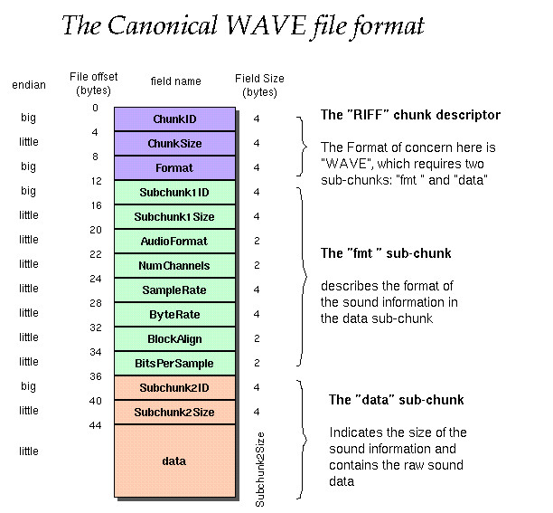

# Bancos de memoria
La función de los bancos de memoria es la de almacenar y distribuir datos fácilmente en el dispositivo implementado. Un banco necesario en los dispositivos pci es el pci_config, el cual posee funciones tales como definir el vendor_id y device_id del dispositivo pci, así como definir las direcciones de memoria de los registros base_address. El siguiente es un ejemplo de cómo se vería esto en un sample-pci-device de simics:

    bank pci_config {
      /* This attribute should contain a list of all BAR registers */
      param base_address_registers = ["base_address_0"];

      register vendor_id { param init_val = 0x104C; } // Texas Instruments
      register device_id { param init_val = 0xAC10; } // PC Card Controller

      register base_address_0 @ 0x10 is (memory_base_address_32) {
          param size_bits = 8;
          param map_func = 1;
      }
      register base_address_1 @ 0x14 is (no_base_address_32);
      register base_address_2 @ 0x18 is (no_base_address_32);
      register base_address_3 @ 0x1C is (no_base_address_32);
      register base_address_4 @ 0x20 is (no_base_address_32);
      register base_address_5 @ 0x24 is (no_base_address_32);
    }

Así mismo, se pueden crear bancos de memoria para las funciones que requieran ser mapeadas en un banco especifico. un ejemplo de esto es la estructura del WAVE, ya que esta requiere de la asignación de múltiples registros destinados a cada parte que compone el audio. Nuevamente, el sample-pci-device proporciona un ejemplo de esto, el cual puede ser utilizado como guía:

    bank reg is function_mapped_bank {
        /* Each register bank need to have a unique function number,
          which should match with the map_func param in one BAR */
        param function = 1;
        param register_size = 4;
        register version      @ 0x0010 "Major and minor version" {
            is read_only;
            param init_val = 0x4711;
        }
    }

La siguiente es una referencia útil a la hora de configurar el banco para el archivo WAVE, ya que contiene detalladamente las partes que conforman este archivo de audio y su tamaño en bytes, así como los bytes de offset correspondientes. Esto es necesario ya que se debe mapear un registro para cada parte del archivo WAVE y así poder manipularlo posteriormente.

http://soundfile.sapp.org/doc/WaveFormat/
