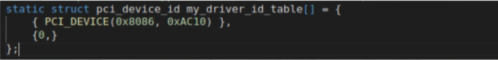

# Conectar Dispositivo PCI al Driver

## Cargar ID
Lo primero que se debe identificar a la hora que querer conectar nuestro dispositivo PCI con el driver, son el ***Vendor ID*** y el ***Device ID***, estás pueden ser localizadas en el banco: _PCI config_, como se muestra en el ejemplo:



Una vez los atributos fueron localizados, el siguiente paso corresponde a cargar estas dirrecciones de memoria en el driver, para esto, en nuestro archivo del driver, identificaremos al estructura estática (_static struct_): "pci_device_id", correspondiente al atributo _id_table_,  en la cuál, meteremos las siguientes instrucciones:

```C
	{PCI_DEVICE(**vendor ID**, **device ID**)}
	{0,}
```
_Imagen de ejemplo:_


## Cargar direcciones del dispositivo en el Driver
Luego tenemos que identificar la clase _my_driver_probe_, que es la que se encarga de realizar los llamados a funciones y enlazar los bancos de memoria (ver anexo de mapeo de bar). Esta recibe como parámetro: "*pdev" (que corresponde al puntero del dispositivo).

```C
	static int my_driver_probe(struct pci_dev *pdev)
```
En esta clase, realizaremos un copia de las variables bar que corresponden a los punteros que apuntan a los bancos de memoria del dispositivo (ver anexo a de mapeo de bar). A continuación, cargaremos en una variable, la dirección de los *bars* del dispositivo con ayuda del parámetro "pdev":

```C
	bar = pci_select_bars(pdev, IORESOURCE_MEM);
```

Por consiguiente cargamos en otra variable las regiones de los campos de memoria del dispositivo en nuestro driver.c:

```C
	err = pci_enable_device_mem(pdev);
	pci_set_master(pdev);
	err = pci_request_regions(pdev, MY_DRIVER);
	pci_device.pdev = pdev;
```
_Imagen de ejemplo:_


## Asignar los punteros bar en el Driver
Una vez obtenemos las direcciones bar del dispositivo, podemos enlazarlos con los bar que poseemos en el driver, esto con ayuda de las instrucciones:

```C
	variable = pci_ioremap_bar(**puntero al dispostivo**, **banco
	de memoria asignado**);
	pci_device.bar1_base_addr = variable;
```
*Imagen de ejemplo:*


## Leer configuración de los registros del dispositivo

Lo último que debemos hacer, sería cargar la información de los registros de configuración del dispositivo PCI en nuestra clase "my_driver_probe", con ayuda de la instrucción":

```C
	pci_read_config_word(**puntero al dispositivo**, PCI_VENDOR_ID,
	**referencia al ID**);
```
 *Imagen ejemplo:*
 


Con esto, ya podremos realizar los llamados a las funciones en el driver (_my_driver_probe_).
