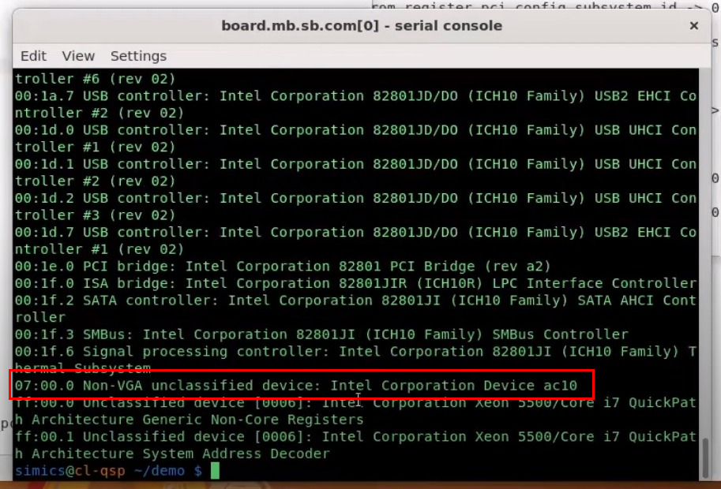

# Comprobar dispositivo PCI conectado

El primer paso para comprobar que si dispositivo PCI está conectado, es
conectarlo. Para una detallada explicación siga los pasos de la correspondiente
sección. Una vez que haya conectado su dispositivo, inicie la simulación simics
con su script.

Una vez cargada, vaya a su máquina serial en la simulación y ejecute el comando
lspci.

<pre><code>$ lspic</code></pre>

La consola posiblemente imprima mucho texto, su dispositivo debería estar en las
últimas entradas casi al final. En la siguiente imagen se muestra el resultado
con un dispositivo PCI conectado cuyo device_id es 0xac10. Recuerde que este
valor se establece en su archivo .dml del dispositivo.

