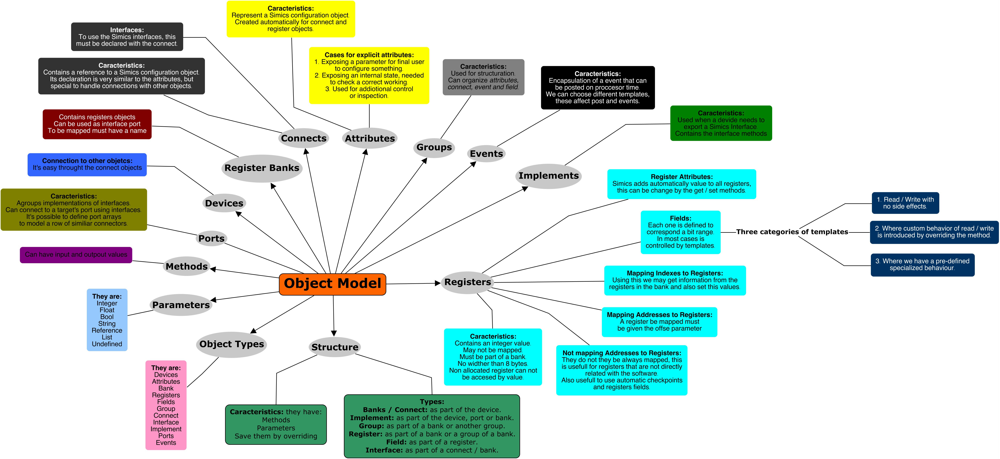

# Qué es DML

Podriamos verlo como un traductor de código hacia C para crear dispositivos. Aunque la explicación del documento es un tanto distinta, esta es la mejor representación que se podría tener de ello. Para entender un poco más ese concepto hay que comprender que en Simics todo lo que se modela, desde dispositivos hasta drivers, se hace al final de todo en C. Entonces para crear un dispositivo en Simics tenemos dos caminos, o creamos un archivo de C con aproximadamente 3000 lineas de código o usamos DML donde declaramos esas 3000 lineas en unas 200 lineas de código. Entonces al final él sí es como un traductor para facilitar la creación de los dispositivos. Posee distintas cosas como registros, bancos, etc; el siguiente diagrama puede ejemplificarlo de una mejor forma las diferentes cosas que se puede hacer con DML.:

Autor: Emmanuel D. Solis.